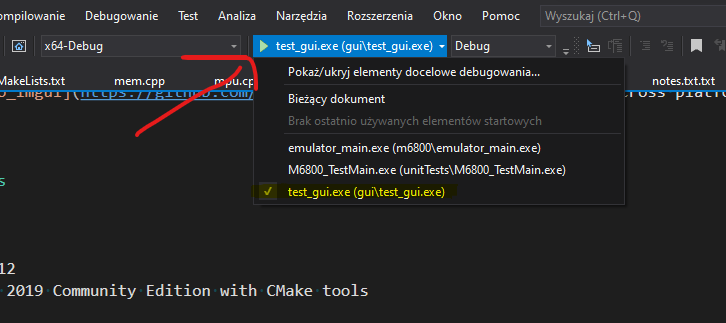

# GUI_setup_test
This project is to check how easy will be making cross platform GUI using DearImGUI (mostly for linux and windows). This is part of work to build cross platform m6800 procesor emulator.

I'm using [hello_imgui](https://github.com/pthom/hello_imgui) project for setting cross platform build system and graphic back end configuration of [DearImGUI](https://github.com/ocornut/imgui) library.

# Building

## Prerequisites

#### Git submodules

Some components (ie MemoryEditor)  are included by using git submodules.
After cloning this repository run
`git submodule update --init --recursive` 

#### Windows

- CMake min. 3.12
- Visual Studio 2019 Community Edition with CMake tools

#### Linux

- CMake 3.12
- C++ compiler with C++17c standard support
- OpenGL Dev library
- libxi-dev
- libxinerama-dev
- libxrandr-dev
- libx11-dev
- libxcursor-dev

#### Emscripten on Linux

## Build

#### Windows

Open directory in visual studio, after configuring select test_gui target to build and launch

#### Linux

Clone repository

	git clone https://github.com/Ranyrety/GUI_setup_test.git
	cd GUI_setup_test/build
 	git submodule update --init --recursive
	cmake ..
	make -j %numberOfParrarelThreads

For more information on building check [hello_imgui build instructions](https://github.com/pthom/hello_imgui#build-instructions)
